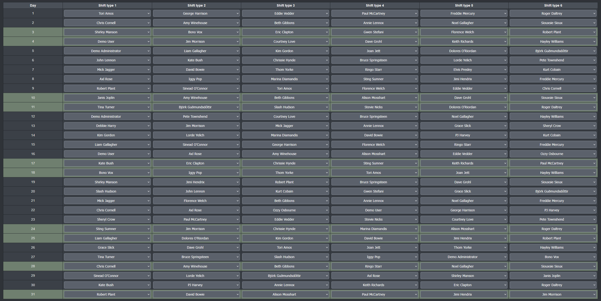
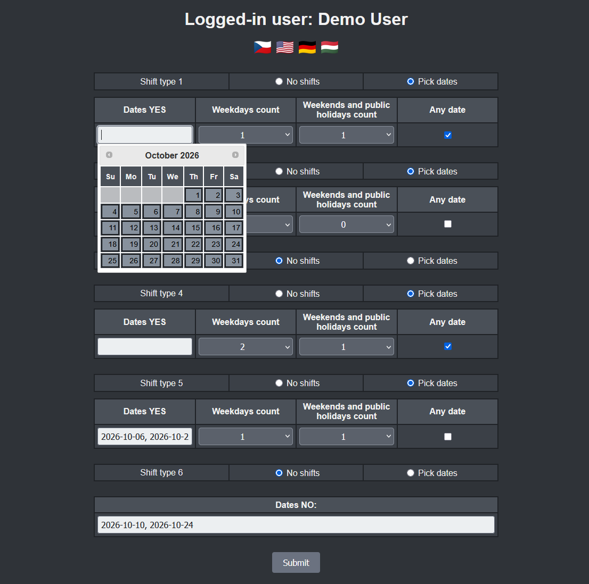
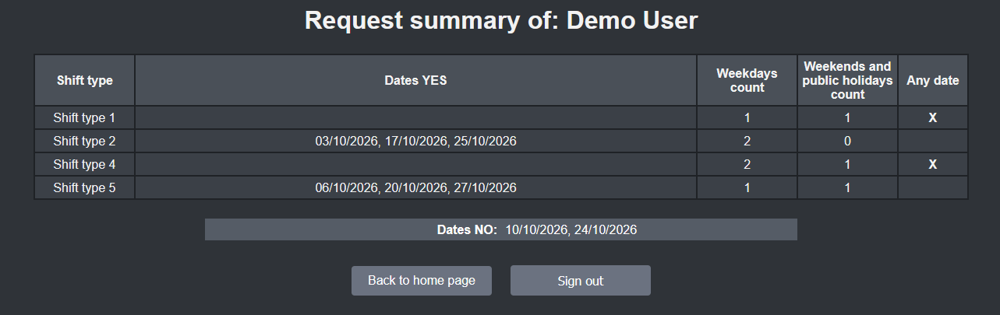
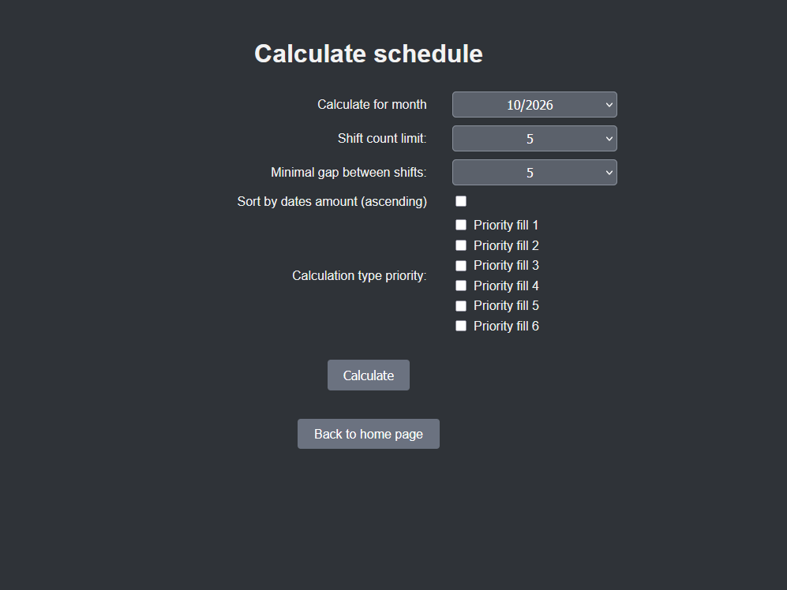
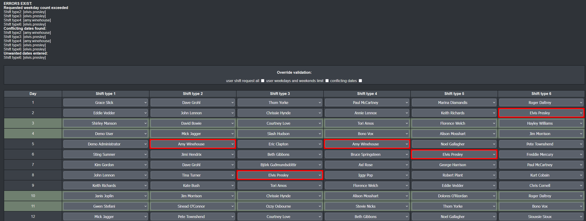
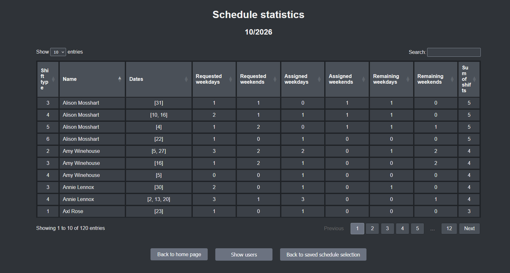
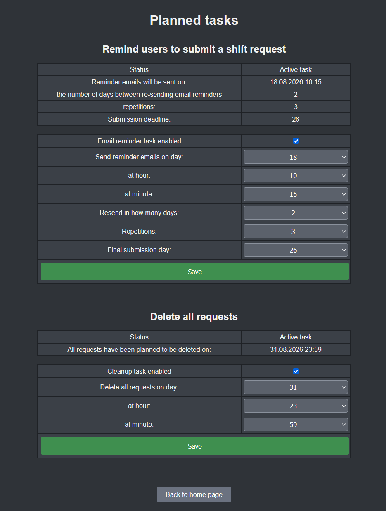
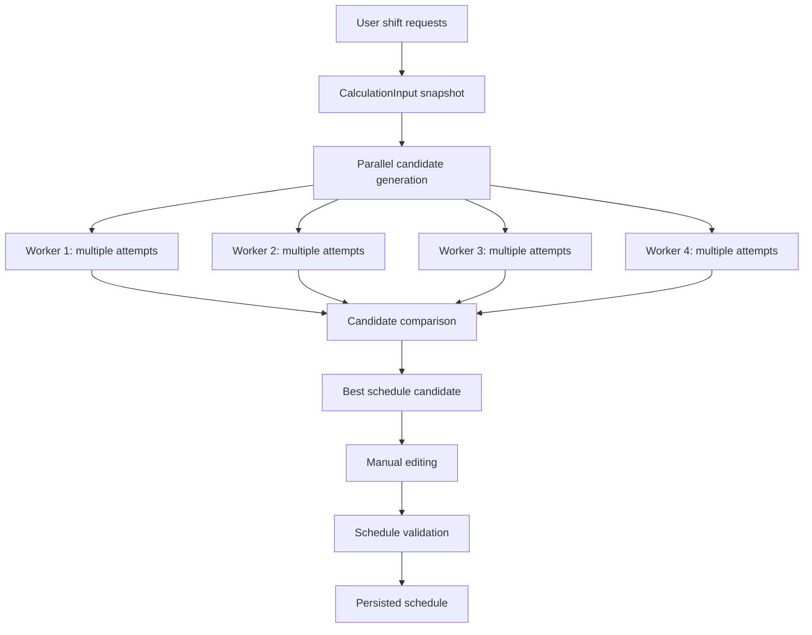

# Hospital Shift Scheduler

**A multilingual Spring Boot application for preference-based monthly
shift planning, built around a parallel schedule-calculation engine.**

Hospital Shift Scheduler helps administrators create monthly staff
schedules from employee shift requests, availability constraints,
shift-type eligibility, and configurable calculation rules.

Rather than producing a single assignment, the calculation engine
generates many candidate schedules in parallel, measures their
**schedule coverage** by the number of successfully placed shift
assignments, and selects the best candidate. Administrators can then
manually edit the generated schedule, validate it against user requests
and calculation constraints, and persist the final result.

Originally designed for a hospital environment, the scheduling model is
not hard-coded to a particular organization: the number of shift types
is configurable at application level.

## Live Demo

The same application is independently deployed to **AWS** and **Microsoft Azure**.

| Deployment | Application |
|---|---|
| AWS | [Open AWS demo](https://aws.richardbrenkus.com) |
| Microsoft Azure | [Open Azure demo](https://azure.richardbrenkus.com) |

### Demo accounts

| Role | Username | Password | Purpose |
|---|---|---|---|
| Demo administrator | `demo-admin` | `Demo*admin*9` | Explore the administrative and scheduling workflow |
| Demo user | `demo-user` | `Demo*user*9` | Submit and review a user's shift request |

The demo administrator can explore the administrative workflow,
including schedule calculation and other non-restricted functions.
Method-level security prevents the demo administrator from deleting
users or shift requests, changing another user's password, and changing
the configured cleanup or email-reminder tasks.

Demo data can be restored to a known baseline independently of the
application.

## Screenshots

### Calculated monthly schedule



### Shift request



### Shift request summary



### Calculation configuration



### Schedule validation and editing



### Schedule statistics



### Planned tasks



## Why This Project Is Technically Interesting

* **Parallel schedule search:** configurable worker threads generate
independent schedule candidates and the best result is selected by
schedule coverage.
* **Editable and re-validatable results:** an administrator can
manually modify the calculated schedule and run validation again
before saving.
* **Immutable calculation snapshots:** worker threads operate on
records detached from JPA entities and Hibernate proxies.
* **Concurrent-calculation guard:** an `AtomicBoolean` prevents
multiple administrators from starting schedule calculations
simultaneously within the running application instance.
* **Persistent email outbox:** reminder emails use durable outbox
rows, retry scheduling, claim tokens, stale-claim recovery, and
failure categorization.
* **Role-based security:** Spring Security combines URL-level access
control with method-level `@PreAuthorize` checks for sensitive
demo-admin operations.
* **Real-database integration tests:** Testcontainers runs integration
tests against MySQL 8.4 with Flyway migrations.
* **Automated CI:** GitHub Actions runs `./mvnw clean verify`,
including Failsafe integration tests and JaCoCo report generation.
* **Four-language UI:** Czech, English, German, and Hungarian message
and validation bundles.

## Technology

**Java 21 · Spring Boot 3.5 · Spring MVC · Spring Security · Spring Data
JPA · Hibernate · MySQL · Flyway · Thymeleaf · Maven · JUnit 5 · Mockito
· Testcontainers · Docker · GitHub Actions**

---

## Core Scheduling Engine

The calculation engine is the central feature of the application.

### Input

The engine receives a `CalculationInput` record containing:

* **Target month** (`YearMonth`)
* **Per-user snapshots** (`UserCalculationData`) containing:

  * allowed shift types
  * unavailable dates (`datesNo`)
  * one `ShiftPreferenceCalculationData` per shift type:

    * priority
    * requested weekday count
    * requested weekend count
    * specific requested dates (`datesYes`)
    * any-date flag
    * no-shift-requested flag
  * assigned dates from the previous month for cross-month gap
validation
  * whether the user has submitted a shift request
* **Calculation profile** (`CalculationProfile`):

  * `shiftCountCap` --- maximum total shifts per user per month
  * `gapBetweenShifts` --- minimum gap between two shifts for the
same user
  * `forceFillShiftTypes` --- shift types that may be filled even
when the specific date was not requested
  * `sortByDatesAmount` --- whether users with fewer requested dates
are prioritized first
* **Public holidays** for the month
* **Shift-type processing order**
* **Priority passes**

### Calculation Flow



### Assignment Algorithm

`ScheduleGenerationEngine` performs assignment in two phases during each
attempt:

1. **Force-fill phase** --- processes only shift types included in
`forceFillShiftTypes`. Eligible users may be assigned even when they
did not specifically request that date, provided the other gap and
count constraints are satisfied.
2. **Regular phase** --- processes the remaining shift types. Only
users who requested the date or selected the any-date option are
eligible.

Within each phase, the engine iterates over shuffled days and then over
configured priorities and shift types. For each combination it chooses
the first eligible user from an ordered candidate list. Users with
specific requested dates are considered before any-date users. Within
the specific-date group, ordering is either by the number of requested
dates or random, depending on `sortByDatesAmount`.

Every successfully placed assignment increments the candidate's **hit
counter**. This counter represents **schedule coverage**, not the number
of user preferences satisfied.

### Multithreading

`ParallelScheduleCalculationService` submits a configurable number of
independent workers to a dedicated `Executor`.

Default configuration:

* **4 worker threads**
* **250 attempts per worker**
* **5-minute worker timeout**

Each `ScheduleCalculationWorker` explores its own candidates
independently. Within each worker, the candidate with the highest hit
counter is retained. `ScheduleCandidateComparators.BY_QUALITY` then
selects the global best result across workers.

Failed or timed-out worker futures resolve without failing the overall
calculation as long as at least one worker produces a candidate.

### Random Seeds and Reproducibility

Each attempt receives a deterministic pseudo-random seed derived from a
worker-specific base seed and the attempt index. The worker base uses
`System.nanoTime()` combined with the worker number, so separate
calculation runs remain non-deterministic.

A captured `attemptSeed` is **not sufficient on its own** to recreate a
candidate. Reproduction requires the same seed **and the identical
`CalculationInput` snapshot**, including users, preferences,
previous-month data, shift types, priorities, holidays, calculation
order, and calculation profile.

### Concurrent Calculation Guard

`ScheduleCalculationService` uses
`AtomicBoolean.compareAndSet(false, true)` so only one schedule
calculation can run at a time within the running application instance.

If another administrator starts a calculation while one is already
running, the application throws `CalculationAlreadyRunningException`,
which is handled by the controller and presented as a user-facing error
rather than an HTTP 500 response.

### Manual Editing and Validation

After calculation, the schedule is displayed as an editable
`ScheduleEditForm`. Administrators can alter assignments and then run
validation again.

`ScheduleValidationService.validateSchedule()` checks:

* per-user shift-count cap
* requested weekday count
* requested weekend count
* minimum gap within the current month
* minimum gap against the previous stored month
* assignment on rejected (`datesNo`) dates
* assignments to users without a submitted shift request

`ScheduleEditForm` also contains category-specific override flags so an
administrator can explicitly acknowledge selected violations and still
save the schedule when operational circumstances require it.

### Saving

Validated schedules are persisted through `StoredScheduleService`.

If a schedule already exists for the target month, the administrator
must confirm before replacing it. A separate override-validation flow
can save a schedule even when validation issues remain.

---

## Main Features

### Shift Planning

* User-submitted preferred dates per shift type
* User-submitted unavailable dates applying across shift types
* Requested weekday and weekend counts
* Any-date and no-shift options
* Configurable shift-type count
* Configurable calculation parameters and processing order
* Parallel candidate-schedule generation
* Force-fill support for selected shift types
* Manual schedule editing
* Post-edit validation with category-level overrides
* Persisted schedules and assignment statistics

### Administration

* User registration, update, and deletion
* Allowed shift-type and profession management
* Administrator view and editing of user shift requests
* Saved schedule review
* Per-user and per-shift-type statistics
* Excel export of schedules and user lists
* CSV activity-log export
* Administrator-configurable reminder and cleanup tasks

### Platform

* `ADMIN`, `USER`, and `DEMO_ADMIN` roles
* Method-level restrictions for sensitive demo-administrator actions
* Persistent email outbox with retry and stale-claim recovery
* Activity logging with optional Kafka publication
* Czech, English, German, and Hungarian localization
* Flyway-managed MySQL schema
* Testcontainers-based MySQL integration tests
* GitHub Actions CI

---

## Concurrency and Data Integrity

### Multi-threaded Schedule Calculation

The default configuration runs four `CompletableFuture`-based workers on
a dedicated executor, with 250 independent attempts per worker.

`ScheduleCalculationWorker` checks
`Thread.currentThread().isInterrupted()` between attempts and before
engine phases so its calculation logic cooperates with thread
interruption.

### Concurrent Calculation Prevention

`ScheduleCalculationService` uses an `AtomicBoolean` guard to prevent
two administrators from starting calculations simultaneously in the same
application instance.

This guard is intentionally JVM-local; it is not a distributed lock.

### Outbox Claim Ownership

`ReminderEmailOutboxClaimService` assigns a UUID claim token and claim
timestamp to an outbox row while it is being processed.

Completion is accepted only when the claim token still matches. This
protects ownership of a claimed row when normal processing and
stale-claim recovery overlap.

### Stale-Claim Recovery

`ReminderEmailOutboxRecoveryService` detects rows that remain in
`PROCESSING` longer than the configured claim timeout (10 minutes by
default) and makes them eligible for retry.

### Transactional Boundaries

Spring `@Transactional` boundaries are used in the service layer, with
read-only operations marked `@Transactional(readOnly = true)` where
applicable.

Outbox claim and completion execute in separate database transactions.
SMTP delivery occurs between them, outside the completion transaction,
keeping database transactions short while allowing reliable retry.

---

## Email Reminder / Outbox Processing

When the configured reminder task runs, an outbox row is created for
each eligible user who has not submitted a current shift request.

`ReminderEmailOutboxProcessor` processes eligible rows on a configurable
fixed delay (10 seconds by default) and in configurable batches (20 rows
by default).

### Processing Flow

1. Query `PENDING` or retryable `FAILED` rows whose `next_attempt_at`
has passed.
2. Claim the row and store a UUID claim token and timestamp.
3. Send the email through `SmtpEmailReminderService`.
4. On success, mark the row `SENT`.
5. On `TransientEmailDeliveryException`, increment the attempt count,
calculate the next retry time, and mark the row `FAILED`.
6. On `PermanentEmailDeliveryException` or an unexpected permanent
failure, mark the row `DEAD`.
7. Stop retrying after the configured maximum attempt count (5 by
default).

Stale `PROCESSING` rows are recovered separately by
`ReminderEmailOutboxRecoveryService`.

Each row carries an idempotency key used as the SMTP `Message-ID` and
`X-Idempotency-Key` to support downstream duplicate recognition.

The database also contains a unique constraint on:

```text
(source_task_id, scheduled_execution_time, recipient_user_id)
```

which prevents duplicate outbox rows for the same logical task execution
and recipient.

### Delivery Semantics

The outbox provides durable retry and protects against duplicate row
creation and concurrent processing of the same claim, but it does
**not** claim end-to-end exactly-once email delivery.

If SMTP accepts an email and the application terminates before the
outbox row is committed as `SENT`, stale-claim recovery can eventually
cause that logical email to be sent again. The stable message
identifiers can assist downstream duplicate recognition, but SMTP does
not guarantee deduplication.

### Cancellation When the Task Is Disabled

When an administrator disables the reminder task in the GUI,
`PlannedTasksService.saveSendReminderTask` bulk-deletes all `PENDING`
and `FAILED` outbox rows for that task within the same transaction that
sets `is_active = false`, and publishes a single aggregate
`REMINDER_EMAIL_JOBS_CANCELED` activity event carrying the deleted-row
count. Rows currently in `PROCESSING` are left in place so an in-flight
SMTP send can drain.

For any row that was `PROCESSING` at the moment of the toggle, or that
stale-claim recovery later releases back to `FAILED`,
`ReminderEmailOutboxProcessor` performs a pre-SMTP check on the next
claim: if the singleton `SendReminderTask` is inactive it calls
`ReminderEmailOutboxCompletionService.cancelClaimedJob(...)`, which
verifies the claim token and deletes the row instead of attempting
delivery. Because canceled rows are removed rather than kept in a
terminal status, the natural-key uniqueness constraint does not block
fresh enqueues when the task is re-enabled.

---

## Scheduled Tasks

### Email Reminder Task

Administrators can configure:

* active/inactive status
* start day, hour, and minute
* sending frequency in days
* number of repetitions
* final submission day

When the task becomes due, it creates outbox rows for users who have not
submitted a current shift request. Email delivery is handled
asynchronously by the outbox processor.

### Shift-Request Cleanup Task

Administrators can configure a recurring cleanup task with a day, hour,
and minute. The configuration is persisted in the database and executed
by `CleanupTaskExecutionService`.

### Task Dispatch

`PlannedTaskExecutorService` evaluates the persisted task configuration
every 60 seconds by default and triggers tasks whose configured
execution time has been reached.

---

## Security

### Authentication

The application uses Spring Security form-based authentication.

* Session timeout: **10 minutes**
* Session cookie: `HOSPITAL_SHIFT_SCHEDULER_SESSION`
* Sessions are not persisted across application restarts

### Roles

| Role | Access |
|---|---|
| `ADMIN` | Full administrative access |
| `USER` | Personal shift-request and account functionality |
| `DEMO_ADMIN` | Administrative demo access with selected sensitive operations restricted |

### DEMO_ADMIN Restrictions

`@EnableMethodSecurity` is enabled.

The following operations are protected so that `DEMO_ADMIN` cannot
invoke them:

* `POST /admin/delete_user`
* `POST /admin/delete_shift_request`
* `POST /admin/change_user_password`
* `POST /admin/cleanup_task`
* `POST /admin/send_reminder_task`

The user-side shift-request deletion endpoint is restricted to `ADMIN`
and `USER`, excluding `DEMO_ADMIN`.

The UI also replaces restricted controls with an explanatory demo
banner, but the server-side `@PreAuthorize` checks are the authoritative
enforcement mechanism.

`DemoAdminAuthorizationTest` verifies the restrictions with MockMvc
without loading JPA, Flyway, or a database.

### CSRF and Access Denied Handling

Spring Security CSRF protection remains enabled. POST forms include CSRF
tokens, and security tests use `.with(csrf())`.

Denied requests are redirected to `/403` and rendered through the
application's dedicated access-denied page.

---

## Database and Persistence

Flyway manages the schema through `V1__initial_schema.sql`.

Hibernate DDL mode is `validate`, so Hibernate checks the schema but
does not modify it at runtime. `spring.jpa.open-in-view` is disabled.

The initial migration also inserts inactive singleton configuration rows
for the cleanup and reminder tasks.

### Key Entities

| Entity | Purpose |
|---|---|
| `User` | Account, role, allowed shift types, and linked shift request |
| `ShiftRequest` | User request containing unavailable dates and shift preferences |
| `ShiftPreference` | Per-shift-type requested dates, counts, priority, and flags |
| `StoredScheduleDay` | Persisted calendar-day data for a saved schedule |
| `StoredUserSnapshot` | Denormalized historical user information stored with assignments |
| `UserStatEntity` | Per-user, per-shift-type assignment statistics |
| `ReminderEmailOutbox` | Durable email-delivery state and retry metadata |
| `ActivityLog` | Append-only application activity history |
| `CleanupTask` / `SendReminderTask` | Persistent singleton planned-task configuration |
| `ScheduledEventsProfile` | Profile entity used by planned-task scheduling logic |

The `reminder_email_outbox` table includes:

* uniqueness on
`(source_task_id, scheduled_execution_time, recipient_user_id)`
* `attempt_count >= 0` check constraint
* dispatch indexes on status and next-attempt time
* stale-claim recovery indexes on status and claim timestamp

Hibernate's default batch fetch size is configured to 100 to reduce
collection-loading query overhead.

---

## Activity Logging

Application events are published through an activity-publishing
abstraction and persisted to the `ActivityLog` table.

Logged events include schedule-calculation lifecycle events,
reminder-email outcomes, and authentication events.

Activity data can be exported as CSV.

Kafka publication is optional. When enabled, activity events can also be
forwarded to a configured Kafka topic; when disabled, a no-op producer
is used.

---

## Localization

The application supports four languages:

| Code | Language |
|---|---|
| `cs` | Czech (default locale) |
| `en` | English |
| `de` | German |
| `hu` | Hungarian |

Language selection is available from the login page through the
`language` request parameter.

The selected locale is stored in the HTTP session using
`SessionLocaleResolver`.

Both UI messages and Bean Validation messages use locale-specific
resource bundles. `LocalValidatorFactoryBean` is wired to the
application `MessageSource` so validation messages follow the selected
UI language.

---

## Testing and CI

### Unit Tests

JUnit 5 and Mockito cover service and algorithm behaviour.

Notable tests include:

* `ScheduleGenerationEngineTest`
* `ScheduleCalculationWorkerTest`
* `ParallelScheduleCalculationServiceTest`
* `ScheduleValidationServiceTest`
* `ReminderEmailOutboxProcessorTest`
* `ReminderEmailOutboxClaimServiceTest`
* `ReminderEmailOutboxCompletionServiceTest`
* `PlannedTaskDispatchServiceTest`
* `PlannedTaskExecutorServiceTest`
* `DemoAdminAuthorizationTest`

### Integration Tests

Integration tests use **MySQL 8.4 through Testcontainers**, not an
in-memory substitute.

`AbstractMySqlContainerTest` provides the shared Spring
Boot/Testcontainers setup and supplies the container JDBC configuration
through `@DynamicPropertySource`.

Actual email delivery is replaced with a `@MockitoBean` during
integration testing.

Integration-test coverage includes:

* landing-page database queries
* email outbox claim/completion workflow
* schedule persistence and retrieval
* stored schedules
* cross-month gap validation
* user statistics
* user and shift-request operations

SQL fixtures under `src/test/resources/sql/` provide deterministic test
data and cleanup.

### GitHub Actions

The repository contains one CI workflow:

```text
.github/workflows/ci.yml
```

It executes:

```bash
./mvnw clean verify
```

During `verify`:

* Maven Failsafe runs integration tests
* JaCoCo generates the coverage report

The workflow uploads the Failsafe and JaCoCo reports as artifacts.

---

## Technology Stack

| Category | Technology |
|---|---|
| Language | Java 21 |
| Framework | Spring Boot 3.5 |
| Web | Spring MVC, Thymeleaf, thymeleaf-extras-springsecurity6 |
| Persistence | Spring Data JPA, Hibernate, MySQL, Flyway |
| Security | Spring Security 6, method security |
| Email | Spring Mail / JavaMailSender, SMTP/Gmail, STARTTLS |
| Messaging | Spring Kafka (optional activity publication) |
| Scheduling | Spring `@Scheduled` |
| Export | Apache POI, CSV |
| Build | Maven, Maven Failsafe Plugin |
| Testing | JUnit 5, Mockito, MockMvc, Spring Security Test, Testcontainers |
| Coverage | JaCoCo |
| Utilities | Lombok, Jakarta Bean Validation |

---

## Deployment

The application is currently deployed independently to:

* **AWS:** [aws.richardbrenkus.com](https://aws.richardbrenkus.com)
* **Microsoft Azure:**
[azure.richardbrenkus.com](https://azure.richardbrenkus.com)

### Runtime Configuration

Datasource configuration is externalized through:

| Variable | Purpose |
|---|---|
| `SPRING_DATASOURCE_URL` | JDBC URL for MySQL |
| `DB_USERNAME` | Database username |
| `DB_PASSWORD` | Database password |
| `SPRING_MAIL_USERNAME` | SMTP username |
| `SPRING_MAIL_PASSWORD` | SMTP application password |
| `ACTIVITY_KAFKA_ENABLED` | Enables optional Kafka activity publication |
| `ACTIVITY_KAFKA_BOOTSTRAP_SERVERS` | Kafka bootstrap servers |
| `ACTIVITY_KAFKA_TOPIC` | Kafka topic |
| `ACTIVITY_KAFKA_CLIENT_ID` | Kafka producer client ID |

`application-dev.properties` and `application-prod.properties` are
present, but neither overrides the datasource placeholders defined in
the base `application.properties`.

No active/default profile is hard-coded; the required profile is
supplied externally.

---

## Running Locally

### Prerequisites

* Java 21
* Maven
* MySQL
* Docker when running Testcontainers-based integration tests

### Start the Application

1. Clone the repository.
2. Create the MySQL database.
3. Set the required environment variables listed above.
4. Activate the appropriate Spring profile.
5. Run:

```bash
./mvnw spring-boot:run
```

Flyway applies `V1__initial_schema.sql` automatically on first startup.

The application is available at:

```text
http://localhost:8080
```

### Run the Full Test Suite

With Docker running:

```bash
./mvnw verify
```

---

## Architecture / Design Highlights

* Calculation threads operate on immutable records rather than JPA
entities.
* The calculation engine is isolated from the Hibernate session state.
* Candidate generation combines controlled randomness with repeatable
per-attempt seeds when the same calculation input is supplied.
* Parallel workers explore independent candidates and a comparator
selects the best schedule coverage.
* An application-level atomic guard prevents concurrent calculations
within one JVM.
* The outbox separates durable delivery state from SMTP transport and
provides retry and stale-claim recovery.
* Database constraints prevent duplicate logical outbox rows for the
same reminder execution and recipient.
* Method-level security is authoritative for restricted
demo-administrator operations.
* Historical schedule assignments use denormalized user snapshots.
* The configurable shift-type count drives the scheduling workflow
without hard-coding a fixed number of types into the business logic.

---

## Portfolio Context

Hospital Shift Scheduler was built as a full-stack Java portfolio
application centred on a non-trivial scheduling problem rather than a
CRUD-only workflow.

The project demonstrates practical use of Java 21 and Spring Boot across
algorithm design, multithreading, concurrency control, JPA/Hibernate
persistence, database migrations, Spring Security, scheduled processing,
resilient email delivery, localization, automated testing, CI, and cloud
deployment.

Although the original domain is hospital shift planning, the underlying
workflow --- collecting employee availability and preferences,
calculating candidate schedules, allowing administrative review, and
validating the result --- can also apply to other organizations that
manage recurring staff scheduling.
